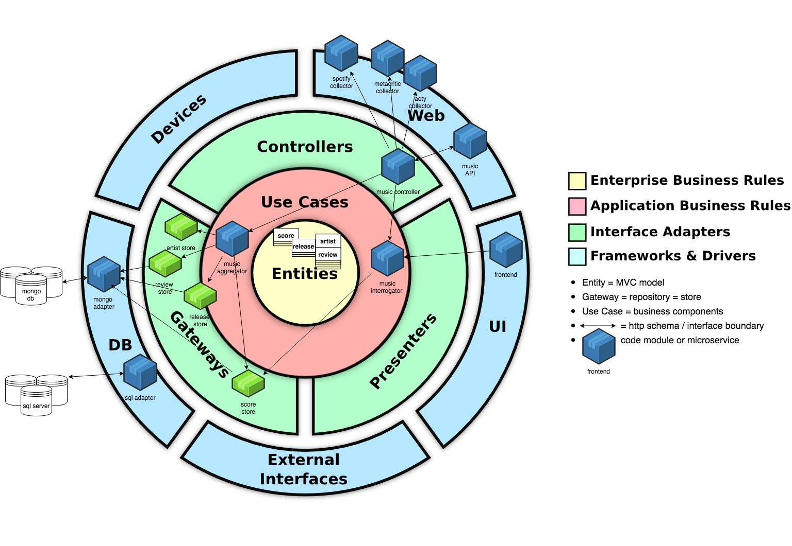

## Clean Architecture

This is the aggregator service for ripe peaches. This service is in charge of retrieving data from the ripe peaches store
and aggregating it for use by the web frontend.

In terms of software architecture our initial aim is to put some clean architectures philosophy into 
practice. To make this easier to follow, our directory structure will map to 
layers of abstraction so that it's easy to identify which layers our modules sit underneath.  

